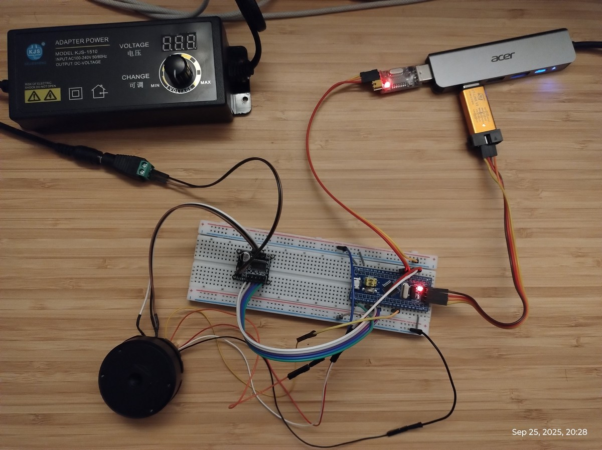
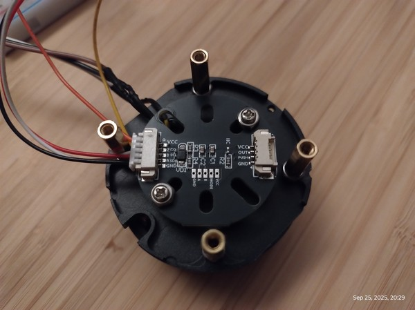

# SimpleFOC BLDC Motor Control for STM32 Blue Pill

Field-oriented control (FOC) firmware for BLDC motors using SimpleFOC library on STM32 Blue Pill + SimpleFOC Mini driver board.

## Current Firmware Features

1. Open‑loop (sensorless) velocity control using SimpleFOC `BLDCMotor` + `BLDCDriver3PWM`.
2. Open‑loop angle control for precise electrical angle positioning (sensorless).
3. Automatic motor pole pair estimation sweep (encoder required).
4. Encoder wiring / signal integrity test streaming angle & velocity.
5. Closed‑loop FOC velocity control (encoder based) with PID + LPF tuning interface.
6. Closed‑loop FOC angle control (encoder based) with cascaded PID architecture.
5. 3‑phase PWM on TIM1 pins: PA8 / PA9 / PA10 (high‑frequency SinePWM).
6. Driver enable (EN / nSLEEP) on PB12 (low during init for safety).
7. Debug serial on `Serial2` (USART2: PA2=TX, PA3=RX) at 115200 baud.
8. Interactive CLI commands for each mode (velocity set, streaming toggle, zero reference, etc.).
9. Streaming telemetry over `Serial2` as CSV (tgt,vel) for use with plotting tools like SerialPlot.

## Hardware Summary

| Component                | Notes |
|--------------------------|-------|
| MCU Board                | STM32 Blue Pill (now configured as F103C8, 64KB flash) |
| Motor Driver             | SimpleFOC Mini v1.0 (DRV8313) |
| Motor                    | Sensorless BLDC (example: 24V, 50KV) |
| Motor Supply (VM)        | 12V (adjust per motor & driver limits) |
| Logic Supply             | 3.3V (shared between Blue Pill & driver logic) |
| Programmer               | ST-Link (SWD) |
| Serial Debug Adapter     | USB‑TTL (3.3V) on PA2/PA3 |
| Optional Encoder         | MT6701 (ABZ incremental mode) |

> If your physical MCU is the smaller C6 (32KB flash), the full SimpleFOC library may not fit. The project is set to `bluepill_foc` for extra flash headroom.

## Wiring Guide


*Complete wiring setup showing STM32 Blue Pill, SimpleFOC Mini driver, BLDC motor, and encoder connections*

### Power Connections
All grounds must be common between components.

| Connection | Notes |
|------------|-------|
| VM (driver) → 12V supply + | Motor power (separate from 3.3V logic) |
| 3.3V (Blue Pill) → 3.3V/VCC (driver) | Logic power supply |
| GND (Blue Pill) → GND (driver) | Common ground |

### Motor Driver (SimpleFOC Mini) Connections

| Blue Pill Pin | SimpleFOC Mini | Purpose |
|---------------|----------------|---------|
| PA8           | IN1 / PWM1     | Phase A PWM |
| PA9           | IN2 / PWM2     | Phase B PWM |
| PA10          | IN3 / PWM3     | Phase C PWM |
| PB12          | EN / nSLEEP    | Driver enable (active HIGH) |

Motor phases → OUT_A / OUT_B / OUT_C (order arbitrary; swap any two to invert direction if needed).

### Debug Serial (USB-TTL Adapter)

| Blue Pill Pin | USB-TTL Adapter | Purpose |
|---------------|-----------------|---------|
| PA2 (TX2)     | RX              | Debug serial out |
| PA3 (RX2)     | TX              | Debug serial in |
| GND           | GND             | Common ground |

> Use 3.3V logic level USB-TTL adapter. Connect at 115200 baud for CLI and telemetry.

### Optional Connections (not used in current firmware)
- **nFAULT** (SimpleFOC Mini) → free GPIO with pull-up for diagnostics
- **Current sensing** pins for torque control (requires hardware modifications)

### MT6701 Encoder (ABZ Mode) Wiring


*MT6701 encoder mounted at the bottom of the BLDC motor showing compact integration*

| MT6701 | Blue Pill | Notes |
|--------|-----------|-------|
| VCC    | 3.3V      | Power (keep leads short, decouple with 100nF) |
| GND    | GND       | Common ground |
| A      | PA0       | TIM2 CH1 (hardware quadrature capable) |
| B      | PA1       | TIM2 CH2 |
| Z (Index) | PB4 (optional) | Not used by SimpleFOC core yet in this test; can observe manually |

Outputs are push‑pull by default → no pull‑ups required. If you configured open‑drain mode, add ~10k pull‑ups to 3.3V on A/B/Z.

Cable tips: twist (A,GND) and (B,GND) pairs or use shield if noisy. Keep distance from high current phase wires.

## Firmware Mode Selection

Switch modes by editing the macros at the very top of `src/main.cpp` (exactly one must be `1`):

```c
#define MODE_OPEN_LOOP 0            // sensorless open-loop velocity demo
#define MODE_OPEN_LOOP_ANGLE 0      // sensorless open-loop angle control demo
#define MODE_POLEPAIR_TEST 0        // automatic estimation of motor pole pairs using encoder
#define MODE_ENCODER_TEST 0         // encoder wiring / angle+velocity streaming
#define MODE_VELOCITY_CLOSED_LOOP 0 // closed-loop FOC velocity control (encoder)
#define MODE_ANGLE_CLOSED_LOOP 1    // closed-loop FOC angle control (encoder)
```

### Summary of Modes
| Mode | Purpose | Requires Encoder | Typical Use |
|------|---------|------------------|-------------|
| `MODE_OPEN_LOOP` | Simple sensorless spin & sanity test | No | Quick functional test |
| `MODE_OPEN_LOOP_ANGLE` | Precise sensorless angle positioning | No | Testing electrical angle mapping |
| `MODE_POLEPAIR_TEST` | Estimate mechanical pole pairs | Yes | When motor pole pairs unknown |
| `MODE_ENCODER_TEST` | Validate wiring & CPR, observe angle/velocity | Yes | First bring-up of sensor |
| `MODE_VELOCITY_CLOSED_LOOP` | Full FOC velocity loop (PID) | Yes | Actual application / performance |
| `MODE_ANGLE_CLOSED_LOOP` | Full FOC angle/position control (cascaded PID) | Yes | Precision positioning applications |

> After determining pole pairs and confirming encoder CPR/direction, use the closed‑loop mode for best torque, low‑speed smoothness, and efficiency.

## Open-Loop Speed Control

[](https://youtu.be/ZVeU-i5agMQ)
*Open-loop speed control demonstration showing motor acceleration and velocity control*

Open-loop (no sensor) approximates rotation and may:
- Cog or stall at very low speeds.
- Require a minimum target velocity to start.
- Produce less torque and efficiency than closed-loop FOC.

Key parameters in `src/main.cpp`:
| Parameter | Purpose | Default |
|-----------|---------|---------|
| `MOTOR_POLE_PAIRS` | Set to your motor's pole pairs (magnets/2) | 11 |
| `SUPPLY_VOLTAGE` | Motor supply (for voltage mapping) | 12.0 |
| `VOLTAGE_LIMIT` | Limits applied phase voltage | 4.0 |
| `target_velocity` | Initial open-loop speed (rad/s) | 10.0 |

Adjust `VOLTAGE_LIMIT` upward gradually if the motor fails to start (watch heat). Increase `target_velocity` for easier startup (e.g. 20–40 rad/s), then reduce.

Rough conversion: rpm ≈ rad/s * 60 / (2π)

### PWM Frequency Selection

The driver PWM frequency affects motor performance, audible noise, and thermal behavior. Configure via `driver.pwm_frequency` in setup().

| Parameter | Typical Range | Default | Notes |
|-----------|---------------|---------|-------|
| `pwm_frequency` | 8–50 kHz | 25 kHz | Higher = quieter but more switching losses |

#### Frequency Trade-offs
- **Audible noise**: < 20 kHz can be audible; ≥ 20 kHz is usually silent
- **Switching losses**: Higher frequency → more MOSFET heating in driver
- **PWM resolution**: Higher frequency → fewer timer ticks → coarser duty control
- **Motor smoothness**: Higher frequency → smoother current, but diminishing returns

#### Quick Calculation (STM32 Timer Resolution)
PWM resolution ≈ timer_clock / pwm_frequency  
Example: 72 MHz timer, 25 kHz → ~2880 ticks (11.5 bits resolution)  
At 50 kHz → ~1440 ticks (10.5 bits), at 100 kHz → ~720 ticks (9.5 bits)

#### Tuning Guidelines
1. **Start at 20–30 kHz** for quiet operation with good resolution
2. **Lower to 8–15 kHz** if driver/MOSFETs overheat (accept some audible noise)
3. **Raise to 30–50 kHz** for very smooth low-speed operation (monitor temperatures)
4. Always verify MOSFET specifications support your chosen frequency

### Serial Command Interface

Open a monitor at 115200 baud on `Serial2` (PA2/PA3 wiring). Send:

```
v 30      # set target velocity to 30 rad/s (~286 rpm)
v -15     # reverse direction
```

You will see periodic status lines:
```
vel target(rad/s): 10.00  est mech rpm ~95.5
```

## Open-Loop Angle Control Mode

[](https://youtube.com/shorts/ZWguelsuv0g)
*Open-loop angle control demonstration showing precise electrical angle positioning*

Precise electrical angle positioning without encoder feedback. Useful for testing motor response, verifying electrical angle mapping, and understanding pole pair configuration.

### When to Use
- Test motor electrical angle response
- Verify pole pair configuration by observing mechanical positions
- Debug SimpleFOC angle control before adding encoder feedback
- Learn relationship between electrical and mechanical angles

### Enabling the Mode
Set only this macro to 1 in `src/main.cpp`:
```c++
#define MODE_OPEN_LOOP_ANGLE 1
#define MODE_OPEN_LOOP 0
#define MODE_POLEPAIR_TEST 0
#define MODE_ENCODER_TEST 0
#define MODE_VELOCITY_CLOSED_LOOP 0
```

### Key Parameters
| Parameter | Purpose | Default | Notes |
|-----------|---------|---------|-------|
| `MOTOR_POLE_PAIRS` | Motor pole pairs (magnets/2) | 11 | Must match your motor |
| `VOLTAGE_LIMIT` | Phase voltage limit | 3.0V | Lower for safer position holding |
| `VELOCITY_LIMIT` | Transition speed between angles | 2.0 rad/s | Controls smoothness of movement |
| `target_angle` | Current target electrical angle | 0.0 rad | Updated via serial commands |

### Serial Commands (115200 baud)
```
a <radians>    # Set target angle in radians (e.g., a 1.57)
d <degrees>    # Set target angle in degrees (e.g., d 90) 
s              # Step by 30 degrees
v <rad/s>      # Set velocity limit (transition speed, e.g., v 1.0)
```

### Example Usage
```
d 0       # Move to 0 degrees (electrical)
d 90      # Move to 90 degrees (1/4 electrical revolution)
d 180     # Move to 180 degrees (1/2 electrical revolution)
s         # Step by 30 degrees from current position
v 0.5     # Set slow transitions (0.5 rad/s)
v 5.0     # Set faster transitions (5.0 rad/s)
```

### Understanding Electrical vs Mechanical Angles
- **Electrical angle**: Controls the magnetic field direction (0-2π rad per electrical cycle)
- **Mechanical angle**: Physical shaft rotation
- **Relationship**: `mechanical_angle = electrical_angle / pole_pairs`

For an 11 pole-pair motor:
- 1 full electrical revolution (2π rad) = ~32.7° mechanical rotation
- 11 electrical revolutions = 1 full mechanical revolution (360°)

### Tuning Guidelines
1. **Start slow**: Begin with `v 1.0` or lower for smooth, observable transitions
2. **Increase voltage carefully**: If motor doesn't hold position, slightly increase `VOLTAGE_LIMIT`
3. **Observe mechanical response**: Each electrical revolution should produce consistent mechanical movement
4. **Test full range**: Try `d 0`, `d 90`, `d 180`, `d 270` to see quarter-step positions

### Troubleshooting
| Issue | Cause | Solution |
|-------|-------|----------|
| Motor shakes violently | Velocity limit too high | Lower with `v 0.5` or `v 1.0` |
| No movement | Voltage too low | Increase `VOLTAGE_LIMIT` slightly |
| Inconsistent positions | Wrong pole pairs | Run pole pair detection mode |
| Jerky transitions | No velocity limiting | Ensure `motor.velocity_limit` is set |

Status output every 2 seconds:
```
Target angle: 1.571 rad (90.0 deg)
```

### Angle Resolution Analysis

Understanding the theoretical and practical angle resolution limits of the open-loop angle control system.

#### System Resolution Limits

| Resolution Type | Value | Notes |
|-----------------|-------|-------|
| **Software (float)** | ~0.000043° | 32-bit float precision limit |
| **PWM Resolution** | ~0.125° electrical | Timer clock ÷ PWM frequency |
| **Mechanical Resolution** | ~0.011° | PWM resolution ÷ pole pairs |
| **Practical Target** | ≥0.1° | Easily achievable with margin |

#### Detailed Calculations (11 Pole-Pair Motor)

**PWM Resolution:**
- STM32 Timer: 72 MHz ÷ 25 kHz = 2880 PWM steps
- Electrical angle resolution: 360° ÷ 2880 = **0.125° electrical**
- Mechanical resolution: 0.125° ÷ 11 pole pairs = **0.011° mechanical**

**Pole Pair Effect:**
- More pole pairs = finer mechanical resolution
- 11 pole pairs: 0.011° mechanical steps
- 7 pole pairs: 0.018° mechanical steps  
- 14 pole pairs: 0.009° mechanical steps

#### Practical Resolution Test

Test fine angle resolution with these commands:
```bash
# Test 0.1° mechanical steps (well above system limit)
d 0      # Start position
d 0.1    # 0.1° step  
d 0.2    # 0.2° step
d 0.5    # 0.5° step

# Test near-limit resolution (~0.01° steps)
d 0
d 0.01   # Very fine step (close to PWM limit)
d 0.02   # Another fine step
```

#### Resolution Limiting Factors

1. **Electronic limits**: PWM quantization (~0.011° for 11 pole pairs)
2. **Motor characteristics**: Detent torque, cogging, magnetic saturation
3. **Mechanical factors**: Bearing friction, backlash, load inertia
4. **Voltage/current limits**: Insufficient torque for small position changes

> **Conclusion**: The system can theoretically achieve ~0.011° resolution, making 0.1° positioning easily achievable with excellent margin.

## Build & Upload

Prerequisites:
- PlatformIO (CLI or IDE)
- ST-Link connected (SWDIO, SWCLK, GND, 3.3V ref, NRST optional)

Commands:
```bash
# Build
platformio run

# Upload
platformio run --target upload

# Serial monitor (adjust port)
platformio device monitor
```

## `platformio.ini` Notes

Important entries:
```
board = bluepill_f103c8
lib_deps = askuric/Simple FOC@^2.3.5
build_flags = -Os -flto
```
Optimization flags help keep the binary within flash limits.

## Pole Pair Detection Mode (Automatic Estimation)

Use this mode to automatically estimate the motor's mechanical pole pairs using a connected incremental encoder. The firmware sweeps a known electrical angle while applying a small q‑axis voltage and measures the resulting mechanical span from the encoder. Estimated pole pairs ≈ (electrical angle swept) / (mechanical angle moved).

### When to Use
Run this once (or a couple of times) when you don't know the motor's pole pair count, before setting `MOTOR_POLE_PAIRS` for open‑loop tuning or moving to closed‑loop FOC. Requires the encoder already wired (A=PA0, B=PA1) and functioning.

### Enabling the Mode
At the top of `src/main.cpp` set only this macro to 1:
```c++
#define MODE_POLEPAIR_TEST 1
#define MODE_OPEN_LOOP 0
#define MODE_ENCODER_TEST 0
```

### Wiring Prerequisites
- Encoder A → PA0, B → PA1 (quadrature)
- Driver EN → PB12, phase PWMs → PA8/PA9/PA10 (same as other modes)
- Motor phases connected; rotor free to rotate (not mechanically loaded)

### Key Parameters (in code)
| Parameter | Meaning | Default |
|-----------|---------|---------|
| `DETECT_VOLTAGE` | Sine voltage magnitude applied during sweep | 2.5 V |
| `MAX_ELECTRICAL_REV` | Max electrical revolutions to sweep before stopping | 14 |
| `STEP_E_ANGLE` | Electrical angle step size (rad) | 0.02 |
| `SETTLE_US` | Microseconds to wait after each step | 2000 |

Increase `DETECT_VOLTAGE` carefully (small increments) if the rotor does not move or stalls (watch temperature & current). Lower it if the motion is abrupt.

### Running & Output
1. Build & flash.
2. Open Serial2 (115200). You'll see:
	- Intro & safety notes
	- Periodic progress lines: `Progress: e_rev=<electrical_revs> mech_span(rad)=<accumulated_mech_angle>` every ~0.5 s
3. The test stops early once enough mechanical span (> ~1.2 revs) is collected, or after the configured electrical span.
4. Final lines:
```
Electrical span used (rad): <value>
Mechanical span (rad): <value>
Estimated pole pairs: <float>
Rounded pole pairs: <integer>
```

Use the rounded integer as your `MOTOR_POLE_PAIRS` value elsewhere in the project. If consecutive runs disagree by more than ±1, increase sweep span (`MAX_ELECTRICAL_REV`) or improve mechanical freedom / increase `DETECT_VOLTAGE` slightly.

### Failure / Edge Cases
| Message | Cause | Action |
|---------|-------|--------|
| `[FAIL] Mechanical span too small` | Rotor hardly moved | Raise `DETECT_VOLTAGE`, ensure no load |
| Very noisy estimate | Mechanical backlash / stiction | Increase voltage slightly; ensure shaft turns smoothly |
| Estimate off by exactly 2× | Misinterpreting pole count (remember pole pairs = magnet count / 2) | Re-run and confirm; count magnets if possible |

### After Detection
1. Copy the rounded pole pair number.
2. Switch back to open‑loop or encoder test mode by toggling macros.
3. Set `MOTOR_POLE_PAIRS` (open‑loop) or use it when configuring closed‑loop FOC.

> Tip: Keep a note of the final pole pair count in this README (e.g. "My motor: 11 pole pairs").

## Encoder Test Mode (MT6701 ABZ)

Before enabling closed-loop FOC, you can verify encoder wiring with a dedicated test build included in `src/main.cpp`.

1. Set the macro at the top of `main.cpp`:
	```c++
	#define MODE_ENCODER_TEST 1   // enable encoder test
	```
	Set back to `0` to return to the motor open-loop demo.

2. Adjust the placeholder:
	```c++
	static const uint32_t ENCODER_PPR = 1024; // set to your configured resolution
	```

3. Flash the firmware and open the Serial2 monitor (PA2/PA3) at 115200 baud.

4. Output columns (tab separated):
	```
	angle_rad    velocity_rad_s    rawApproxCounts
	```

5. Commands:
	- `z` : capture current angle as zero (software offset)
	- `r` : toggle fast streaming (~500 Hz) / slow (20 Hz)

6. Validation steps:
	- Rotate shaft slowly forward → angle increases smoothly.
	- Reverse direction → angle decreases (or invert later using `encoder.direction = Direction::CCW;`).
	- One full revolution ≈ `ENCODER_PPR` change in `rawApproxCounts` (after zeroing).
	- Velocity near zero while stationary; proportional to speed when moving.

If angle direction is inverted you can either swap A/B lines or (preferred) set direction in code when moving to closed-loop.

> This test mode is only for signal validation. For real operation switch to `MODE_VELOCITY_CLOSED_LOOP` once CPR & direction are confirmed.

## Closed-Loop Velocity FOC Mode

Enabled when `MODE_VELOCITY_CLOSED_LOOP` = 1. Provides field‑oriented control with an incremental encoder (AB). Adjust these constants near the mode block if needed:

| Constant | Meaning | Example |
|----------|---------|---------|
| `MOTOR_POLE_PAIRS` | Mechanical pole pairs (magnets/2) | 11 |
| `ENCODER_PPR` | Pulses per revolution (SimpleFOC calculates CPR internally) | 1024 |
| `SUPPLY_VOLTAGE` | Driver supply (for voltage mapping) | 12.0 V |
| `VOLTAGE_LIMIT` | Max q‑axis voltage demand (limits current/heat) | 6.0 V |
| `target_velocity` | Initial commanded velocity (rad/s) | 10.0 |

### CLI Commands (Serial2 115200)
```
v <rad_s>   set target velocity (ex: v 25)
s           stop (target = 0)
p           one-shot status line
r           toggle 5 Hz telemetry streaming
z           capture current mechanical angle as zero reference
```

Status line fields (streaming):

- CSV header: tgt,vel (printed once when streaming starts)
- CSV row: tgt,vel

Example:

```
10.000,9.872
10.000,9.913
```

Tip: I removed the bundled `foc_plot.py`; use SerialPlot (https://hackaday.io/project/166357-serialplot) or similar to visualize the `tgt` and `vel` columns in real time.

### PID & Filter Tuning
Parameters (inside the closed-loop section in code):
| Symbol | Typical Start | Effect |
|--------|---------------|--------|
| `PID_velocity.P` | 0.4–1.0 | Proportional response (stiffness) |
| `PID_velocity.I` | 5–25 | Removes steady-state error; too high → oscillation / windup |
| `PID_velocity.D` | 0 | Derivative damping (often not needed) |
| `PID_velocity.output_ramp` | 500–2000 | Limits rate of voltage command change |
| `PID_velocity.limit` | = `VOLTAGE_LIMIT` | Safety clamp of controller output |
| `LPF_velocity.Tf` | 0.02–0.08 s | Larger smooths noise, adds lag |

#### PID & Velocity parameter reference

Below is a concise reference table for the closed-loop velocity controller parameters and their recommended ranges.

| Parameter           | What it controls        | Unit         | Typical Range | Extreme Limits | Notes                                       |
| ------------------- | ----------------------- | ------------ | ------------- | -------------- | ------------------------------------------- |
| **P**               | Proportional gain       | V/(rad/s)    | 0.2 → 0.8     | 0 → ~2        | Higher = faster, but oscillates if too high |
| **I**               | Integral gain           | V/(rad/s·s)  | 1 → 15        | 0 → ~100      | Too high → windup, sluggish overshoot       |
| **D**               | Derivative gain         | V·s/rad      | 0 → 0.01      | 0 → 1          | Avoid unless overshoot is persistent        |
| **output_ramp**    | Voltage slope limit     | rad/s² equiv | 400 → 700     | 0 → 10000      | Lower = smoother, higher = snappier         |
| **limit**           | Max PID output voltage  | V            | 6 → 9         | 0 → supply     | Clamp for safety                            |
| **Tf**              | Velocity LPF time const | s            | 0.02 → 0.05   | 0 → 0.2        | Lower = faster but noisier                  |
| **velocity_limit** | Max target speed        | rad/s        | 40 → 60       | 0 → ∞          | Set based on motor KV × V                   |


Tuning procedure (quick):
1. Start with moderate `P` (0.5). `I=10`, `D=0`.
2. Increase `P` until you see slight overshoot / buzz, then back off ~20%.
3. Increase `I` so steady velocity error < 2–3% (watch for drift while stopped).
4. Add `LPF_velocity.Tf` if velocity readout is noisy → raise gradually (0.02 → 0.05 → 0.08).
5. Only add derivative if oscillations persist and can’t be fixed by reducing `P` / `I`.

If the motor spins the wrong direction compared to command, you can:
* Swap any two motor phase wires (electrically inverts torque), or
* In code, invert sensor direction before `initFOC()` (e.g. `encoder.direction = Direction::CCW;`).

### Common Closed-Loop Issues
| Symptom | Likely Cause | Fix |
|---------|--------------|-----|
| Hunts / oscillates | P or I too high | Reduce P first, then I |
| Slow to reach target | P too low or ramp limit small | Raise P or `output_ramp` |
| Drifts when target=0 | I windup / bias | Lower I, add small deadband via code, or zero offset |
| High pitched noise | PWM frequency resonance | Accept or adjust mechanical mounting; driver set to 25 kHz already |
| Jumps at enable | Improper alignment / wrong pole pairs | Re-run pole pair detection, verify CPR |

### Logging Improvements (Optional Ideas)
You can add a higher‑rate binary or CSV stream or simple min/max tracking inside the 5 Hz telemetry block. For deeper analysis, temporarily raise streaming frequency and capture with a logic/USB serial tool.

## Closed-Loop Angle Control FOC Mode

Precision position control using cascaded PID architecture: angle controller → velocity controller → voltage/current controller. Enabled when `MODE_ANGLE_CLOSED_LOOP` = 1.

### System Architecture
- **Outer loop**: Angle PID converts position error to velocity command
- **Inner loop**: Velocity PID converts velocity error to voltage command  
- **FOC layer**: Converts voltage command to optimal phase currents

This cascaded approach provides smooth motion profiles with velocity limiting and excellent disturbance rejection.

### When to Use
- Precision positioning applications (robotics, automation)
- Multi-point positioning sequences  
- Smooth point-to-point motion with automatic velocity profiling
- Applications requiring both position accuracy and speed control

### Enabling the Mode
Set only this macro to 1 in `src/main.cpp`:
```c++
#define MODE_ANGLE_CLOSED_LOOP 1
#define MODE_OPEN_LOOP 0
#define MODE_OPEN_LOOP_ANGLE 0
#define MODE_POLEPAIR_TEST 0
#define MODE_ENCODER_TEST 0
#define MODE_VELOCITY_CLOSED_LOOP 0
```

### Key Parameters
| Constant | Meaning | Default | Notes |
|----------|---------|---------|-------|
| `MOTOR_POLE_PAIRS` | Mechanical pole pairs (magnets/2) | 11 | Must match your motor |
| `ENCODER_PPR` | Pulses per revolution (SimpleFOC calculates CPR internally) | 1024 | Set to your encoder configuration |
| `SUPPLY_VOLTAGE` | Driver supply voltage | 12.0V | For voltage mapping |
| `VOLTAGE_LIMIT` | Max phase voltage | 6.0V | Limits current/heating |
| `VELOCITY_LIMIT` | Max velocity during angle moves | 8.0 rad/s | Controls transition speed |
| `ANGLE_STEP` | Default step size for 's' command | 0.1745 rad (10°) | Configurable |

### CLI Commands (Serial2 115200)
```
a <rad>     set target angle in radians (e.g., a 1.57)
d <deg>     set target angle in degrees (e.g., d 90)
s           step by configured angle increment (default: 10°)
z           zero position (capture current angle as reference)
p           single-shot status (CSV: tgt,pos,vel)
r           toggle 5Hz continuous telemetry streaming
```

### Example Command Sequence
```
z           # Zero current position
d 90        # Move to 90 degrees
d 180       # Move to 180 degrees  
d 0         # Return to zero
s           # Step 10 degrees
s           # Step another 10 degrees (now at 20°)
a 3.14159   # Move to π radians (180°)
```

### Telemetry Output
**CSV Format**: `tgt,pos,vel`
- `tgt`: Target angle (radians)
- `pos`: Current mechanical position (radians) 
- `vel`: Current velocity (rad/s)

**Example streaming output**:
```
tgt,pos,vel
1.5708,0.0234,-0.0123
1.5708,0.1245,2.4563
1.5708,0.8934,3.2145
1.5708,1.4567,1.8934
1.5708,1.5698,0.0234
1.5708,1.5708,0.0000
```

### PID Tuning Parameters

#### Angle Controller (Outer Loop)
| Parameter | Purpose | Default | Range | Notes |
|-----------|---------|---------|-------|-------|
| `P_angle.P` | Position error response | 20.0 | 5-50 | Higher = faster approach, risk of overshoot |
| `P_angle.I` | Steady-state error correction | 0.0 | 0-5 | Usually not needed for angle control |
| `P_angle.D` | Overshoot damping | 0.1 | 0-1 | Helps prevent oscillation |
| `P_angle.limit` | Max velocity command | 8.0 rad/s | 1-20 | Must match `VELOCITY_LIMIT` |

#### Velocity Controller (Inner Loop)  
| Parameter | Purpose | Default | Range | Notes |
|-----------|---------|---------|-------|-------|
| `PID_velocity.P` | Velocity error response | 0.3 | 0.1-1.0 | Lower than pure velocity mode |
| `PID_velocity.I` | Velocity steady-state correction | 3.0 | 1-10 | Lower than pure velocity mode |
| `PID_velocity.D` | Velocity damping | 0.0 | 0-0.1 | Usually not needed |
| `PID_velocity.limit` | Max voltage command | 6.0V | 3-12V | Safety voltage limit |

#### Low-Pass Filters
| Parameter | Purpose | Default | Range | Notes |
|-----------|---------|---------|-------|-------|
| `LPF_velocity.Tf` | Velocity measurement smoothing | 0.01s | 0-0.1s | Lower = more responsive |
| `LPF_angle.Tf` | Angle measurement smoothing | 0.0s | 0-0.05s | Usually not needed |

### Tuning Procedure

#### 1. Start with Conservative Values
Use the defaults as starting points - they're designed to be stable but may not be optimal for your specific motor/load combination.

#### 2. Tune Velocity Loop First
1. Set angle P gain very low (e.g., 5.0)
2. Send step commands and observe velocity response
3. Tune velocity PID as in velocity-only mode
4. Look for smooth acceleration/deceleration curves

#### 3. Tune Angle Loop
1. Gradually increase angle P gain until response is snappy
2. Add angle D gain if overshoot occurs
3. Test with various step sizes (small and large)
4. Verify smooth motion profiles in telemetry

#### 4. Optimize for Your Application
- **Precision positioning**: Higher angle P, moderate velocity limits
- **Fast point-to-point**: Higher velocity limits, moderate angle P  
- **Smooth motion**: Add velocity filtering, moderate gains throughout
- **Heavy loads**: Increase integral gains, lower derivative gains

### Motion Profile Behavior

The cascaded controller automatically generates smooth motion profiles:

1. **Acceleration phase**: Angle error large → high velocity command → motor accelerates
2. **Constant velocity phase**: Velocity reaches limit → motor maintains max speed  
3. **Deceleration phase**: Approaching target → velocity command decreases → smooth deceleration
4. **Settling phase**: Fine position corrections at low velocity

**Velocity Profile Example** (90° step):
```
Time  | Target | Position | Velocity
------|--------|----------|----------
0.0s  | 90°    | 0°       | 0 rad/s
0.1s  | 90°    | 15°      | 4.2 rad/s  ← accelerating
0.2s  | 90°    | 45°      | 8.0 rad/s  ← max velocity
0.3s  | 90°    | 75°      | 8.0 rad/s  ← constant speed
0.4s  | 90°    | 88°      | 2.1 rad/s  ← decelerating  
0.5s  | 90°    | 90°      | 0 rad/s    ← settled
```

### Common Tuning Issues

| Issue | Symptoms | Likely Cause | Fix |
|-------|----------|--------------|-----|
| **Oscillation around target** | Position wobbles ±few degrees | Angle P too high | Reduce `P_angle.P` by 20-30% |
| **Overshoot** | Overshoots target, returns slowly | Insufficient damping | Increase `P_angle.D` to 0.2-0.5 |
| **Slow approach** | Takes too long to reach target | Angle P too low | Increase `P_angle.P` gradually |
| **Velocity overshoot** | Jerky motion, velocity spikes | Velocity loop unstable | Reduce velocity PID gains |
| **Never quite reaches target** | Stops short by small amount | Friction/static load | Add small `P_angle.I` (0.1-1.0) |
| **Noisy velocity readings** | Erratic velocity in telemetry | Encoder noise | Increase `LPF_velocity.Tf` to 0.02-0.05 |

### Advanced Applications

#### Multi-Point Sequences
```c++
// Example: Square pattern (requires code modification)
float targets[] = {0, PI/2, PI, 3*PI/2, 0};  // 0°, 90°, 180°, 270°, 0°
// Send each target with delays for settling
```

#### Dynamic Velocity Limits
Modify `motor.velocity_limit` in real-time for adaptive motion profiles:
- Fast moves for large steps
- Slow, precise moves for small adjustments

#### Position-Dependent Gains
Adjust PID gains based on position for optimal performance across the full range of motion.

### Integration with External Controllers

The CSV telemetry format (`tgt,pos,vel`) is compatible with:
- **SerialPlot**: Real-time visualization of motion profiles
- **Python/MATLAB**: Data logging and analysis
- **LabVIEW**: Integration with larger control systems
- **Custom applications**: Simple comma-separated parsing

---

## Safety & Power Tips

1. Always connect GND first; disconnect VM last.
2. Keep fingers and loose items clear of the spinning motor.
3. If the motor vibrates without spinning: increase `target_velocity` or `VOLTAGE_LIMIT` slightly.
4. If it gets hot quickly: lower `VOLTAGE_LIMIT` and re-test.
5. For better performance, add a position sensor (AS5600, AS5048A, hall, or encoder) and switch to full FOC (`motion_control = velocity` or `angle`).

## Notes on Further Extensions

Potential next steps (not yet implemented in this repo):
1. Angle (position) control mode with soft motion profiling.
2. Torque / current (Iq) control (needs current sensing hardware & driver support).
3. Automatic PID auto‑tune utility & runtime parameter save to flash.
4. Index (Z) pulse handling for sub‑count absolute referencing.
5. Lightweight binary telemetry protocol for higher sample rates.

## Troubleshooting Quick List

| Symptom | Possible Cause | Fix |
|---------|----------------|-----|
| No serial output | Wrong pins / port | Use PA2/PA3 @ 115200; select correct /dev/tty* |
| Motor twitches only | Too low voltage / speed | Raise `VOLTAGE_LIMIT` or `target_velocity` |
| Upload fails (OpenOCD) | ST-Link connection | Re-seat SWD wires; try slower adapter speed |
| Direction opposite | Phase order | Swap any two motor phase wires |
| Overcurrent / heat | Excess voltage limit | Lower `VOLTAGE_LIMIT` |